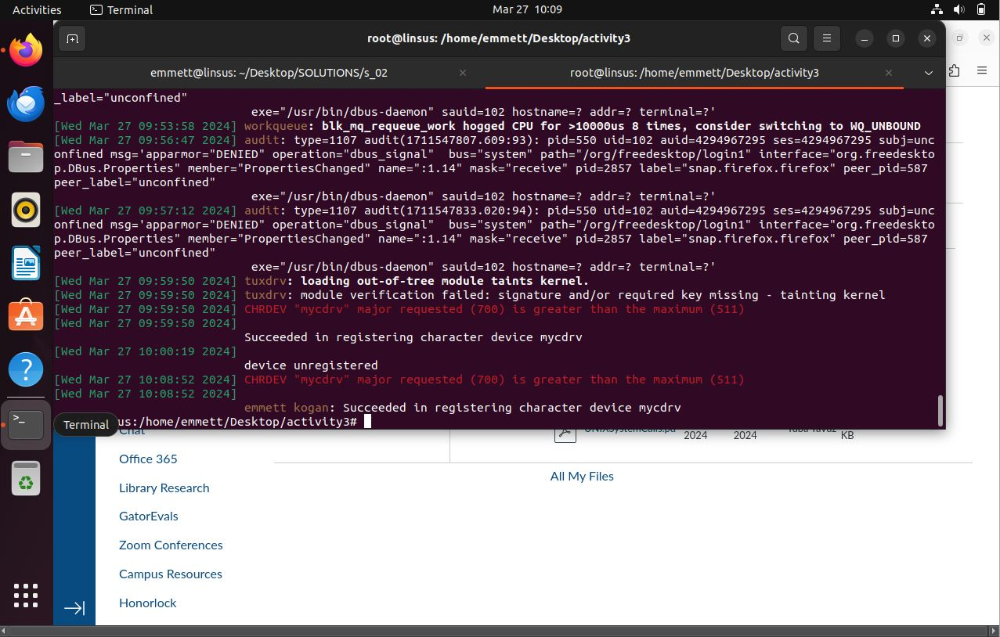
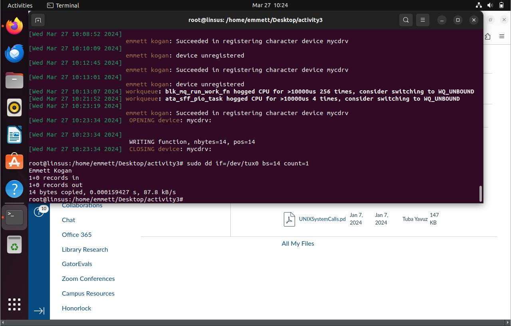
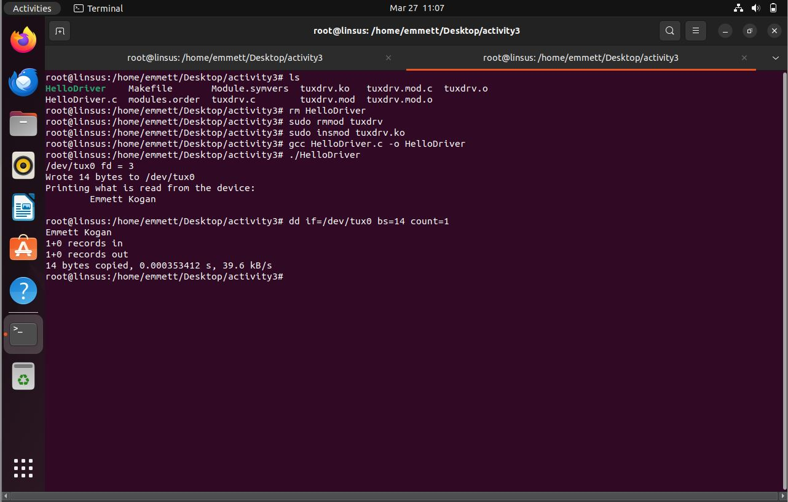
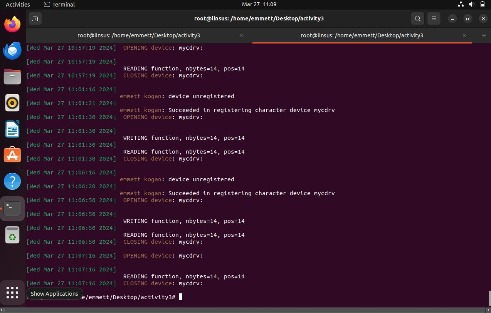

# ASP Activity 3

## Contributors
1. Emmett Kogan

## Part 13

Part 13 screenshot: log message prior to fixing the major number

## Part 14

Fixed major number bug for this part, running old version of HelloDriver prior to when I wrote the read code. Instead uses `dd` to show the effect on the internal buffer.

## Part 19 (bonus)

Console output and dmesg output of the bonus. Note that after registering (where it says my name), it opens the device, writes/reads to it via `HelloDriver`, then reads again via `dd`, and this is reflected in the console output.